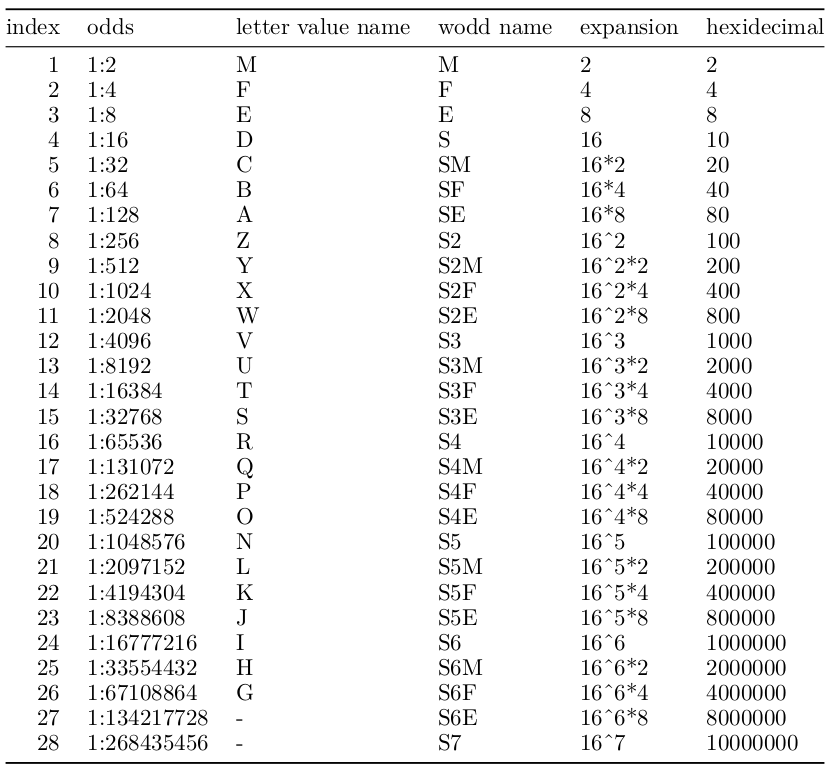

<!-- README.md is generated from README.Rmd. Please edit that file -->
<h1 align="center">
Whisker Odds (wodds)
</h1>
<p align="center">
sensible summary statistics for big data
</p>
<!-- badges: start -->
<!-- badges: end -->

The goal of `wodds` is to make the calculations of whisker odds (wodds)
easy. Wodds follow the same rules as letter-values, but with a different
naming system.

## Installation

You can install the development version of `wodds` from
[GitHub](https://github.com) with:

``` r
# install.packages("devtools")
devtools::install_github("alexhallam/wodds")
```

## Example

This is a basic example which shows you how to solve a common problem:

``` r
options(digits=1)
library(wodds)
library(knitr)
set.seed(42)
a <- rnorm(n = 1e4, 0, 1)
df_wodds <- wodds::wodds(a)
df_wodds
#> # A tibble: 11 × 3
#>    lower_value wodd_name upper_value
#>          <dbl> <chr>           <dbl>
#>  1    -0.00625 M            -0.00625
#>  2    -0.694   F             0.663  
#>  3    -1.17    E             1.16   
#>  4    -1.57    S             1.52   
#>  5    -1.88    SM            1.87   
#>  6    -2.17    SF            2.15   
#>  7    -2.41    SE            2.41   
#>  8    -2.66    S2            2.64   
#>  9    -2.86    S2M           2.88   
#> 10    -3.01    S2F           3.22   
#> 11    -3.13    S2E           3.34
```

Outliers beyond the last `wodd` are marked with `O<value>` in ascending
order. There should rarely be more than 7 outliers when using `wodds`.

``` r
df_wodds_and_outs <- wodds::wodds(a, include_outliers = TRUE)
df_wodds_and_outs
#> # A tibble: 17 × 3
#>    lower_value wodd_name upper_value
#>          <dbl> <chr>           <dbl>
#>  1    -0.00625 M            -0.00625
#>  2    -0.694   F             0.663  
#>  3    -1.17    E             1.16   
#>  4    -1.57    S             1.52   
#>  5    -1.88    SM            1.87   
#>  6    -2.17    SF            2.15   
#>  7    -2.41    SE            2.41   
#>  8    -2.66    S2            2.64   
#>  9    -2.86    S2M           2.88   
#> 10    -3.01    S2F           3.22   
#> 11    -3.13    S2E           3.34   
#> 12    -3.14    O1            3.34   
#> 13    -3.18    O2            3.47   
#> 14    -3.20    O3            3.50   
#> 15    -3.33    O4            3.58   
#> 16    -3.37    O5            4.33   
#> 17    -4.04    O6           NA
```

Though not necessary it is possible to include tail area if additional
communication or teaching is needed. It is assumed that the `wodd`
should be explanatory enough to not need to rely on `tail_area`.

``` r
df_wodds_and_outs <- wodds::wodds(a, include_tail_area  = TRUE)
df_wodds_and_outs
#> # A tibble: 11 × 4
#>    tail_area lower_value wodd_name upper_value
#>        <dbl>       <dbl> <chr>           <dbl>
#>  1         2    -0.00625 M            -0.00625
#>  2         4    -0.694   F             0.663  
#>  3         8    -1.17    E             1.16   
#>  4        16    -1.57    S             1.52   
#>  5        32    -1.88    SM            1.87   
#>  6        64    -2.17    SF            2.15   
#>  7       128    -2.41    SE            2.41   
#>  8       256    -2.66    S2            2.64   
#>  9       512    -2.86    S2M           2.88   
#> 10      1024    -3.01    S2F           3.22   
#> 11      2048    -3.13    S2E           3.34
```

An example with all options set to `TRUE`.

``` r
df_wodds_and_outs <- wodds::wodds(a, include_depth = TRUE, include_tail_area = TRUE, include_outliers = TRUE)
df_wodds_and_outs
#> # A tibble: 17 × 5
#>    depth tail_area lower_value wodd_name upper_value
#>    <int>     <dbl>       <dbl> <chr>           <dbl>
#>  1     1         2    -0.00625 M            -0.00625
#>  2     2         4    -0.694   F             0.663  
#>  3     3         8    -1.17    E             1.16   
#>  4     4        16    -1.57    S             1.52   
#>  5     5        32    -1.88    SM            1.87   
#>  6     6        64    -2.17    SF            2.15   
#>  7     7       128    -2.41    SE            2.41   
#>  8     8       256    -2.66    S2            2.64   
#>  9     9       512    -2.86    S2M           2.88   
#> 10    10      1024    -3.01    S2F           3.22   
#> 11    11      2048    -3.13    S2E           3.34   
#> 12    NA        NA    -3.14    O1            3.34   
#> 13    NA        NA    -3.18    O2            3.47   
#> 14    NA        NA    -3.20    O3            3.50   
#> 15    NA        NA    -3.33    O4            3.58   
#> 16    NA        NA    -3.37    O5            4.33   
#> 17    NA        NA    -4.04    O6           NA
```

A `knitr::kable` example for publication.

``` r
knitr::kable(df_wodds_and_outs, align = 'c',digits = 3)
```

| depth | tail\_area | lower\_value | wodd\_name | upper\_value |
|:-----:|:----------:|:------------:|:----------:|:------------:|
|   1   |     2      |    -0.006    |     M      |    -0.006    |
|   2   |     4      |    -0.694    |     F      |    0.663     |
|   3   |     8      |    -1.169    |     E      |    1.155     |
|   4   |     16     |    -1.569    |     S      |    1.524     |
|   5   |     32     |    -1.878    |     SM     |    1.866     |
|   6   |     64     |    -2.173    |     SF     |    2.150     |
|   7   |    128     |    -2.415    |     SE     |    2.409     |
|   8   |    256     |    -2.656    |     S2     |    2.637     |
|   9   |    512     |    -2.857    |    S2M     |    2.883     |
|  10   |    1024    |    -3.013    |    S2F     |    3.220     |
|  11   |    2048    |    -3.130    |    S2E     |    3.338     |
|  NA   |     NA     |    -3.139    |     O1     |    3.339     |
|  NA   |     NA     |    -3.181    |     O2     |    3.471     |
|  NA   |     NA     |    -3.200    |     O3     |    3.495     |
|  NA   |     NA     |    -3.331    |     O4     |    3.585     |
|  NA   |     NA     |    -3.372    |     O5     |    4.328     |
|  NA   |     NA     |    -4.043    |     O6     |      NA      |

### Getting the depth

``` r
wodds::get_depth_from_n(n=15734L, alpha = 0.05)
#> [1] 11
```

### Getting the sample size

``` r
wodds::get_n_from_depth(d = 11L)
#> [1] 15734
```

## Whisker Odds and Letter-Values

Letter-Values are a fantastic tool! I think the naming could be
improved. For this reason I introduce whisker odds (wodds) as an
alternative naming system. My hypothesis is that with an alternative
naming system the use of these descriptive statistics will be see more
use. This is a rebranding of a what I think is a powerful modern
statistical tool.


